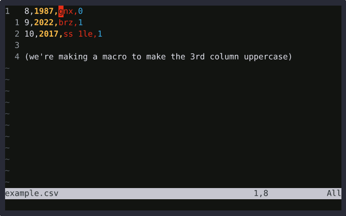

<h1 align="center">
  
</h1>

The "standard" way to edit/fix a macro that you have already recorded is to paste the macro's register contents into a buffer, edit the contents, yank them back into the same register, and then undo the changes to the buffer. That works, but it is slow and clunky.

This plugin improves the situation by providing a customizable mapping (`<Leader>q{register letter}` by default) that constructs an ex command to edit the macro register's contents directly, like `:let @a="{contents here}"`.

And the ex command is inside of the command-line-window instead of the command-line, so you retain all of your mappings and modes for editing. It's as if you were in a normal buffer.



## Installation
To install the plugin, you can use a plugin manager or (neo)vim's built-in package manager, like so:
  1. (Optional) Run `:help packages` to learn a bit about package management.
  2. If you don't already have one, create a package containing a `start` directory. (For example, I call mine `utilities`, and it contains my essential plugins.)
      - Vim:
          ```
          mkdir -p ~/.vim/pack/utilities/start
          cd ~/.vim/pack/utilities/start
          ```
      - Neovim:
          ```
          mkdir -p ~/.local/share/nvim/site/pack/utilities/start
          cd ~/.local/share/nvim/site/pack/utilities/start
          ```
  3. Now clone this plugin repository into that `start` directory.<br>
      `git clone https://github.com/simmsbra/vim-macaroni.git`<br>
      Your directory structure will now look similar to this:<br>
      ```
      pack
      └── utilities
          └── start
              └── vim-macaroni
                  ├── demo.gif
                  ├── doc
                  │   ├── macaroni.txt
                  │   └── tags
                  ├── LICENSE
                  ├── logo.png
                  ├── plugin
                  │   └── macaroni.vim
                  └── README.md
      ```
  4. (Optional) Run `:nmap <Leader>q` to make sure that the default mapping is now present.
      ```
      n  [q            <Plug>MacaroniGetRegisterLetterThenOpenForEditing;
      ```
      (Here, my `mapleader` is set to `[`. If yours is unset, then `\` will be used.)
  5. (Optional) Run `:help local-additions` to make sure that the plugin help now appears.
      ```
                                  *local-additions*
      |macaroni.txt|  Edit macros with <Leader>q{register letter}
      ```
To update the plugin, run `git pull` in `vim-macaroni/`.<br>
To remove the plugin, delete `vim-macaroni/`.

## Usage
Refer to the help file by [reading it here](doc/macaroni.txt) or by running `:help macaroni.txt` after installing.

## Thanks
Thank you, wife, for creating the logo and for listening to me talk about vim.

Thank you, zdcthomas, for writing [medit](https://github.com/zdcthomas/medit), which served as a reference for how to use just one mapping for all registers.

Thank you, people who wrote the vim help pages.

Thank you, tpope, for writing plugins that served as good references.

Thank you, people whose explanations I read online while researching things about vimscript.

And thank you for visiting.
